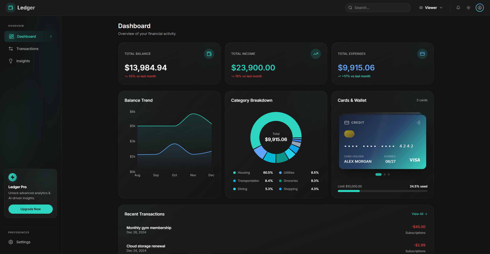
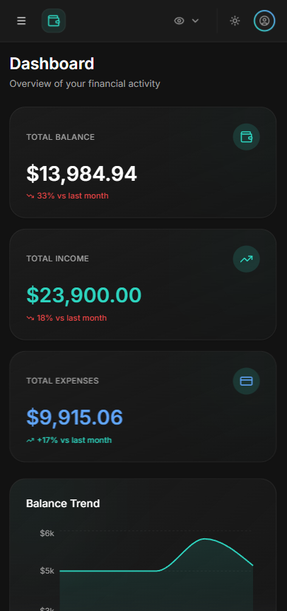
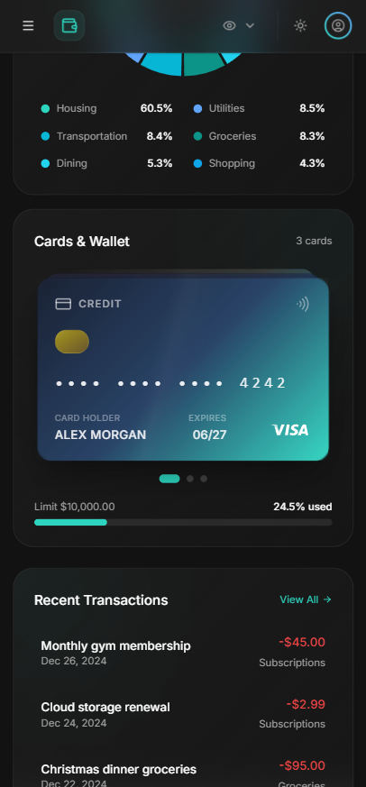

# Ledger — Personal Finance Dashboard

> Built for Zorvyn's Frontend Engineering Assessment

[Live Demo](https://ledger-hazel-one.vercel.app/) · [Repository](https://github.com/Rupesh-Singh-Karki/Ledger)

---



---

## What Is This

Ledger is a client-side finance dashboard for tracking income, expenses, and spending patterns. I built it as a frontend assessment for Zorvyn — a fintech infra company focused on financial visibility for SMEs. The goal was not to build something feature-complete but to show how I think about product architecture, component design, and user experience in a financial context.

---

## Features

| Feature | Details |
|---|---|
| Dashboard | Summary cards with MoM trends, balance area chart, category donut, recent transactions |
| Transactions | Search, filter, sort, add/edit/delete (Admin), CSV export |
| Natural Language Queries | Ask questions about your data in plain English — computed client-side, no AI API |
| Role-Based UI | Admin vs Viewer — controls disabled (not hidden) with permission tooltips |
| Insights | 4 computed cards: top category, MoM change, savings rate, largest expense |
| Theming | Dark/light mode with CSS custom property design tokens, persisted |
| Persistence | Zustand + localStorage — survives page refresh |
| Responsive | Mobile-first, table → card view on small screens, collapsible sidebar |

<p align="center">
  
  &nbsp;
  
</p>

---

## Tech Stack

| Tool | Why I Chose It |
|---|---|
| React 19 + TypeScript | Type safety catches bugs at compile time, not runtime |
| Vite | Faster dev server than CRA, better DX for component iteration |
| Tailwind CSS v4 | Utility-first keeps styles co-located with markup — easier to maintain |
| shadcn/ui | Accessible Radix primitives I can style without fighting the library |
| Recharts | Declarative API that fits React's mental model, easy ResponsiveContainer |
| Zustand | Less boilerplate than Redux for this scope, persist middleware in 3 lines |
| React Router v6 | Industry standard, lazy loading routes is straightforward |
| date-fns | Lightweight, tree-shakeable — no need for the full Moment.js weight |
| Sonner | Works with shadcn out of the box, cleaner than react-hot-toast |
| Lazy Loading (React.lazy + Suspense) | Pages are code-split at the route level — the browser only downloads the JS for the page the user is actually visiting. Keeps initial load fast regardless of how large the app grows. |
| Debounced Search (custom hook) | Search input waits 300ms after the user stops typing before filtering. Prevents re-computing filtered transactions on every keystroke — matters more as transaction count grows. |

---

## Architecture

### Folder Structure

```text
src/
├── api/              # Mock API layer — all data access goes through here
├── components/       # UI split by feature domain, not by type
│   ├── dashboard/
│   ├── transactions/
│   ├── insights/
│   ├── layout/
│   ├── rbac/
│   └── ui/
├── hooks/            # Custom hooks own async state (loading, error, data)
├── store/            # Zustand — source state only, never derived data
├── utils/            # Pure functions: calculations, formatters, export
├── types/            # All interfaces in one place
└── pages/            # Route-level components, lazy loaded
```

### Four Decisions Worth Explaining

**1. Derived state is never stored**
The Zustand store holds only raw transactions, role, theme, and filters. Everything else — totals, trends, category breakdowns, insights — is computed on-the-fly by pure functions in `utils/calculations.ts`.

Why: If you store `totalBalance` and add a transaction but forget to update the total, your UI shows wrong data. Computing it means it is always mathematically correct. This is the single-source-of-truth principle.

**2. The mock API layer exists for a reason**
No component imports from `data/transactions.ts` directly. Every data access goes through `api/` functions that wrap results in simulated 400–600ms delays. Components interact only with custom hooks that manage loading/error/data states.

Why: Swapping mock data for a real API later requires changing only the `api/` layer. Zero component changes. This is what "backend-ready" actually means in frontend architecture — not a buzzword, a structural decision.

**3. RBAC disables, it does not hide**
Viewer role users can see every button and action that Admin can — they just cannot use them. Disabled state with permission tooltips instead of conditional rendering.

Why: Hiding features from users who cannot use them creates confusion ("where did that button go?"). Showing them with a clear explanation is better UX and better for discoverability. This is a real pattern in production RBAC systems.

**4. Performance was treated as a constraint, not an afterthought**
Two specific optimizations worth mentioning:

Lazy loading — All three pages (Dashboard, Transactions, Insights) are loaded with `React.lazy` and wrapped in `Suspense` with skeleton fallbacks. The browser only parses and executes the JavaScript for the page the user visits. On a slow mobile connection this is the difference between a 1s and 3s initial load.

Debounced search — The search input in the Transactions page uses a custom `useDebounce` hook (300ms delay) before triggering the filter logic. Without this, every single keystroke recomputes the filtered transaction list and re-renders the table. With 50 transactions this is invisible. With 5,000 it is not. Writing it correctly from the start is the right habit.

Both of these are production patterns, not interview tricks.

---

## The Natural Language Query Feature

This is the part I am most proud of.

On the Insights page, there is a query input where you can ask plain English questions about your financial data:

- "How much did I spend on Dining?"
- "Compare October and September"
- "What is my savings rate?"
- "What is my biggest expense?"

No external AI API. No NLP library. Pure client-side pattern matching against real computed data from your transaction history.

The parser (`utils/queryParser.ts`) normalizes input, runs it through ordered pattern matchers, and returns a computed answer with formatted values. It handles category queries, month-specific queries, comparisons, trend detection, and gracefully falls back when it cannot understand a question.

I built this because I wanted one feature that showed product thinking — not just "here is a filter" but "here is something that makes the data feel alive and useful."

---

## Data Design

52 hand-crafted transactions spanning August–December 2024.

Not randomly generated. Deliberately structured to tell a financial story:

- Recurring pattern: $4,500 salary on the 1st, $1,200 rent on the 2nd
- October anomaly: $800 flight to Chicago — creates a visible chart spike
- November variation: $1,200 freelance project — income varies meaningfully  
- December: holiday shopping + investment dividend
- 3 pending transactions to demonstrate status handling

This matters because charts with random data look random. Charts with intentional data show trends, patterns, and insights that actually make sense to a user.

---

## Getting Started

```bash
git clone <repo-url>
cd ledger
npm install
npm run dev
```

Open `http://localhost:5173`

Default role is Viewer. Switch to Admin using the role dropdown in the header to access add/edit/delete functionality.

---

## What I Would Do Differently

- Add unit tests for `utils/calculations.ts` — pure functions are straightforward to test with Vitest and this is where bugs would hurt most.
- The query parser uses simple string matching which breaks on typos. A real implementation would use fuzzy matching (fuse.js) or a small locally-run model.
- `localStorage` has a size limit. For a real app with hundreds of transactions, I would use IndexedDB instead.
- The mock API delay is artificial. A real integration would need proper error retry logic, request cancellation, and caching strategy (React Query would handle this well).

---

## Known Limitations

- RBAC is frontend-only simulation — not a security mechanism
- Data resets if localStorage is cleared
- No real currency conversion — USD only
- Query parser does not handle typos or complex sentence structures

---

## Author

**Rupesh Singh Karki**  
Role applied for: Frontend Engineer Intern  
Assessment for: Zorvyn FinTech
